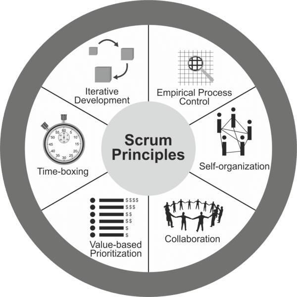

These are the core guidelines for applying the framework and **must** be used in all Scrum projects.

They are:

## Control Over Empirical Process  
This principle highlights the core of the Scrum philosophy, based on three main ideas:  
- **Transparency**  
- **Inspection**  
- **Adaptation**

It supports learning through experimentation, especially when the problem is not well defined or there are no clear solutions.

## Self-organization  
Today’s workers generate significantly greater value when they are self-organized. This leads to:  
- Full **commitment** from the team  
- **Shared responsibility**  
- And importantly, an **innovative and creative environment** that fosters growth

## Collaboration  
Focused on the three fundamental dimensions of collaborative work:  
- **Awareness**  
- **Articulation**  
- **Appropriation**

It also promotes project management as a shared process of value creation, where teams work and interact not only with each other but also with the **customer** and other **business stakeholders** to deliver maximum value.

## Value-based Prioritization  
This principle emphasizes Scrum’s focus on delivering the **highest business value** from the beginning of the project and throughout its duration.

## Time-boxing (durata predeterminata) 
In Scrum, **time is considered a limiting constraint** and is used to help manage project planning and execution effectively. The elements with **predetermined durations** (time-boxed) include:  
- **Sprint**  
- **Daily Standup Meeting**  
- **Sprint Planning Meeting**  
- **Sprint Review Meeting**  
- **Sprint Retrospective Meeting**

## Iterative Development  
This principle highlights how to better **manage change** and build products that meet customer needs. It also outlines the responsibilities of the **Product Owner** and the **organization** related to iterative development.
