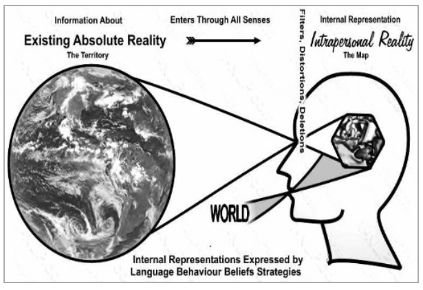

### TL;DR

The map–territory relation, Alfred Korzybski's concept, emphasizes that a representation (map) is not the thing itself (territory); confusing the two leads to misunderstanding.

  
---

### Key Ideas
- The distinction between a model and reality—“the map is not the territory” and “the word is not the thing.”
- We often confuse our mental models, beliefs, or concepts about something **with** the actual thing—this leads to flawed reasoning and rigid perception.
- Our internal “maps” are always simplifications; awareness of this helps improve communication, thinking, and decision-making.
- Explored by thinkers like Borges, Carroll, Magritte, McLuhan, Baudrillard, and others across fields like semantics, ontology, and media studies.

---

### Identity Principle  
> « An idea, word, or model is not the thing itself—mistaking the two leads to error. »

---

### Action Idea
- When using or creating models or concepts, stay aware that they’re **tools**, not truth.
- Ask: “Is this map still useful?” or “Where does my model fail to match the territory?”
- Practice updating beliefs when new data or experience contradicts your internal “map.”

---

### TGD
- Baudrillard’s “precession of simulacra”: when models become more real than reality.
- General semantics: methods to avoid identification errors.
- Artistic and literary metaphors: Magritte’s *This is not a pipe*, Borges’s infinite map.
- "Science and Sanity" by Korzybski
- "Simulacra and Simulation" by Baudrillard
- "On Exactitude in Science" by Borges

---

### Related Notes

---

### Source  
- [Map–territory relation | Wiki](https://en.wikipedia.org/wiki/Map%E2%80%93territory_relation)
