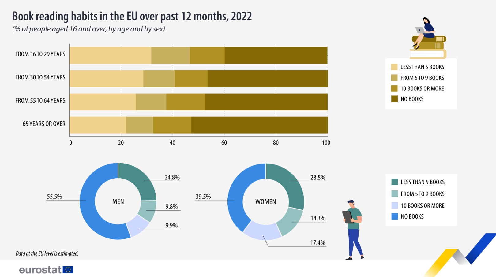
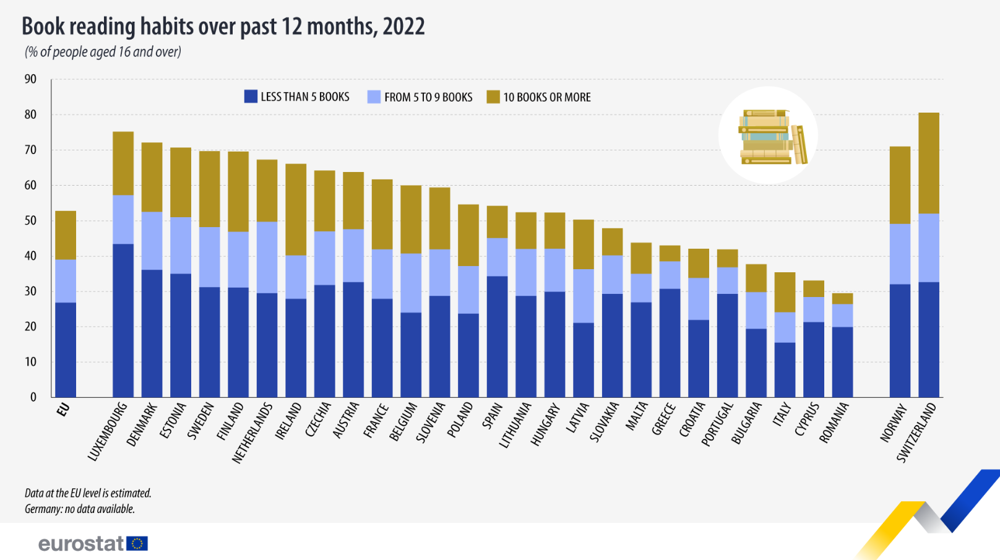

All EU countries read more than Italy (where only 40% of people read books), except Cyprus and Romania.

---
### Sources
- [Younger people and women in the EU read more books, 2024
](https://ec.europa.eu/eurostat/web/products-eurostat-news/w/ddn-20240809-2#:~:text=In%202022%2C%20according%20to%20EU,years%20and%20older%20(47.2%25).)