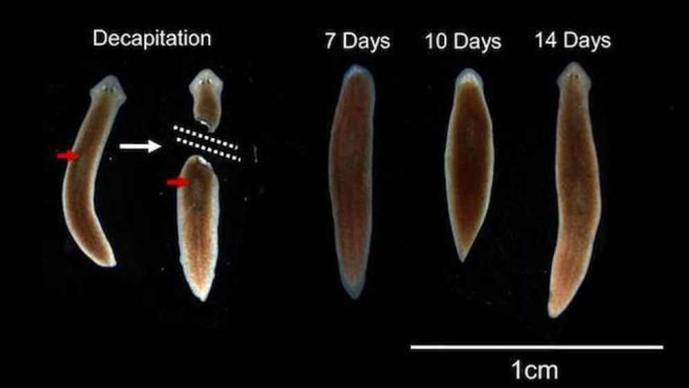

### TL;DR  

---
### Key Ideas
- **Somatic memory** is the way the body stores lived experiences, especially physical and emotional ones.
- Memory is not only in the brain; skin, muscles, and organs can “remember.”
- This memory is dynamic, blends with other experiences, and can influence behavior unconsciously.
- Scientific evidence from _Schmidtea mediterranea_ (regenerative flatworms) shows memory can persist outside the brain.
- Early bodily experiences (tactile, kinesthetic, proprioceptive, nociceptive, and interoceptive) shape implicit memory and can influence behavior later.
- Somatic psychotherapy can help release tension and promote emotional healing 

---
### Identity Principle
> «Our body itself is a repository of memory; experiences are encoded not just in thought but in sensation, movement, and physical tension»

---
### Action Idea
- Observe bodily sensations to become aware of stored tensions.
- Use practices such as **breathing, movement, and relaxation** to access and release somatic memories.
- Note triggers like touch, smell, or sound that may reactivate past emotions

---
### TGD
- 

---
### Related Notes
- [[ ]]

---
### Source
- [Il corpo ricorda: la memoria somatica | Antropia.it](https://www.antropia.it/memoria-somatica-il-corpo-rc/#:~:text=La%20memoria%20somatica%20rappresenta%20dunque,cui%20ci%20relazioniamo%20agli%20altri.)
- [Somatic Memory | Charliehealth.com](https://www.charliehealth.com/post/somatic-memory)
- [Flatworms Lose their Heads but note Their Memories](https://now.tufts.edu/2013/07/18/flatworms-lose-their-heads-not-their-memories)
- [The neuroscience of body memory: From the self through the space to the others | Pubmed](https://pubmed.ncbi.nlm.nih.gov/28826604/), Giuseppe Riva, Cortex, 2018
- [Clinical Manifestations of Body Memories: The Impact of Past Bodily Experiences on Mental Health. Brain sciences | Pubmed](https://pmc.ncbi.nlm.nih.gov/articles/PMC9138975/), A. Gentsch, E.Kuehn, 2022