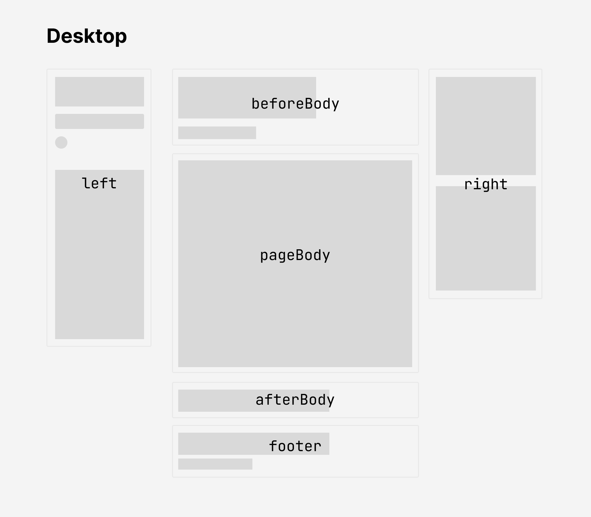

Welcome to my digital garden 🪴 a virtual space where I periodically store all kinds of information I encounter throughout my life.

Information are stored following the [PARA method](./Resources/PARA%20Method.md), a tool created by Thiago Forte.

# How it works
The site is built using a three-column layout:

  
You will find:

- On the left: the `Search box`, `Light/Dark mode button`, and `Reader mode button`. Below that, a list of notes, mostly organized into PARA folders.
- In the center: the main content of the note, the `Page body` (you’re currently reading one of them).
- On the right: the `Graph View` (showing hashtags and other notes linked to the one you're currently reading), the `Table of Contents` (where the text is organized using titles and subtitles), and the `List of Backlinks` (notes that reference the one you're reading).

# Credits
This corner of the internet is: 
- built with [Quartz](https://github.com/jackyzha0/quartz), a fast static-site generator that turns Markdown content into fully functional websites — huge kudos to [Jacky Zhao](https://github.com/jackyzha0). My cloned repo is [this one](https://github.com/mangiarco/digit-garden).
- hosted on [GitHub](https://github.com/), a cloud-based platform for storing, sharing, and collaborating on code, using [GitHub Pages](https://pages.github.com/)
- written in [Obsidian](https://obsidian.md/), one of the most versatile and powerful free note-taking applications